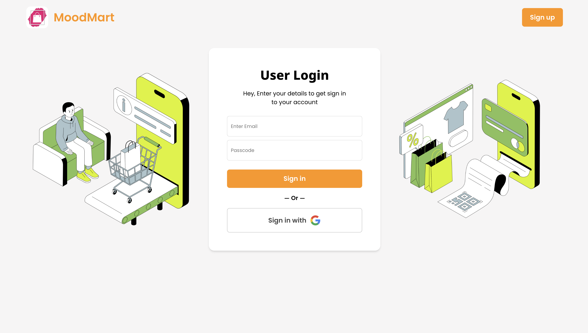
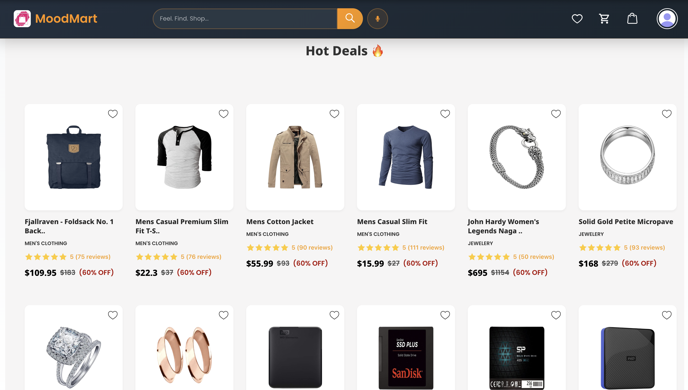

<h1 align="center">🛍️ MoodMart — AI-Powered Personalized Shopping Platform</h1>

<p align="center">
  🚀 A revolutionary full-stack AI-powered e-commerce platform that transforms your emotions into personalized shopping experiences using <b>real-time mood detection</b> and intelligent product recommendations.
</p>

<p align="center">
  
  
  
  
  
  
</p>
<br>

---

## 📖 Problem Statement
Traditional e-commerce platforms offer generic shopping experiences without considering user emotions, leading to poor product discovery, low customer satisfaction, decision fatigue, and missed sales opportunities in the modern retail landscape.

<br>

---

## 💡 Our Solution
MoodMart is a full-stack AI-powered personalized shopping platform built to:

- 🎭 Analyze real-time facial expressions using advanced computer vision with 94%+ accuracy
- 🛒 Provide emotion-based product recommendations across multiple categories
- 🔍 Offer intelligent search with voice recognition and mood-influenced results
- 👤 Deliver secure user authentication with Google Sign-In integration
- 📱 Create responsive shopping experience across all devices
- 💾 Maintain persistent shopping data with local storage optimization
<br>

---  

## 🚀 Features

✅  **Real-time emotion detection** with advanced computer vision algorithms  
✅  **Mood-based product recommendations** with 5 emotion states (Happy, Sad, Angry, Surprised, Neutral)  
✅  **Professional e-commerce interface** with Amazon-style design and smooth animations  
✅  **Voice search functionality** with Web Speech API integration  
✅  **Secure Firebase authentication** with Google Sign-In support  
✅  **Complete shopping workflow** with cart, wishlist, and order management  
✅  **Responsive design** optimized for desktop, tablet, and mobile devices

<br>

---  

## 🛠️ Tech Stack

<div align="center">

<table>
<thead>
<tr>
<th>🖥️ Technology</th>
<th>⚙️ Description</th>
</tr>
</thead>
<tbody>
<tr>
<td></td>
<td>Modern frontend with component architecture</td>
</tr>
<tr>
<td></td>
<td>Authentication, database, and hosting services</td>
</tr>
<tr>
<td></td>
<td>State management for shopping cart and user data</td>
</tr>
<tr>
<td></td>
<td>Real-time facial emotion recognition</td>
</tr>
<tr>
<td></td>
<td>Voice search and speech recognition</td>
</tr>
<tr>
<td></td>
<td>Modern responsive design with animations</td>
</tr>
<tr>
<td></td>
<td>Backend mood detection server (optional)</td>
</tr>
</tbody>
</table>

</div>

<br>

---

## 📁 Project Directory Structure

```
MoodMart/
├── 📂 docs/                        # 📸 Screenshots and documentation
│   ├── 📄 Cart.png                 # 🛒 Shopping cart screenshot
│   ├── 📄 Dashboard.png            # 📊 Dashboard screenshot
│   ├── 📄 Home_Page.png            # 🏠 Home page screenshot
│   ├── 📄 Orders.png               # 📦 Orders page screenshot
│   ├── 📄 Profile_Page.png         # 👤 Profile page screenshot
│   ├── 📄 Signin_Page.png          # 🔐 Sign in page screenshot
│   ├── 📄 Signup_Page.png          # 📝 Sign up page screenshot
│   └── 📄 Wishlist.png             # ❤️ Wishlist page screenshot
├── 📂 public/                      # 🌐 Static assets and HTML
│   ├── 📄 index.html               # 🏠 Main HTML template
│   └── 📂 models/                  # 🤖 AI model files
│       ├── 📄 face_expression_model-shard1
│       ├── 📄 face_expression_model-weights_manifest.json
│       ├── 📄 tiny_face_detector_model-shard1
│       └── 📄 tiny_face_detector_model-weights_manifest.json
├── 📂 src/                         # 🎨 React application source
│   ├── 📂 Components/              # 🧩 Reusable UI components
│   │   ├── 📂 Category/            # 🏷️ Product category components
│   │   │   ├── 📂 Img/             # 🖼️ Category images
│   │   │   │   ├── 📄 heart.png    # ❤️ Heart icon
│   │   │   │   ├── 📄 jwelery.png  # 💎 Jewelry icon
│   │   │   │   ├── 📄 men.png      # 👔 Men's clothing icon
│   │   │   │   ├── 📄 pc.png       # 💻 Electronics icon
│   │   │   │   ├── 📄 women.png    # 👗 Women's clothing icon
│   │   │   │   └── 📄 rating.png   # ⭐ Rating stars
│   │   │   ├── 📄 Electronics.js   # 💻 Electronics category
│   │   │   ├── 📄 Jewelery.js      # 💎 Jewelry category
│   │   │   ├── 📄 Men.js           # 👔 Men's clothing
│   │   │   ├── 📄 Women.js         # 👗 Women's clothing
│   │   │   ├── 📄 Popular.js       # ⭐ Popular categories
│   │   │   └── 📄 popular.css      # 🎨 Category styles
│   │   ├── 📄 Home.js              # 🏠 Main page with mood detection
│   │   ├── 📄 Navbar.js            # 🔝 Navigation header
│   │   ├── 📄 LowerNav.js          # 🔻 Bottom navigation
│   │   ├── 📄 MoodDetector.js      # 🎭 Emotion detection component
│   │   ├── 📄 MoodBasedRecommendations.js # 🎯 AI recommendations
│   │   ├── 📄 CartSection.js       # 🛒 Shopping cart
│   │   ├── 📄 Lists.js             # ❤️ Wishlist management
│   │   ├── 📄 Orders.js            # 📦 Order history
│   │   ├── 📄 Profile.js           # 👤 User profile
│   │   ├── 📄 ProductPage.js       # 📄 Product details
│   │   ├── 📄 Payment.js           # 💳 Payment processing
│   │   ├── 📄 Signin.js            # 🔐 User authentication
│   │   ├── 📄 Signup.js            # 📝 User registration
│   │   ├── 📄 Deals.js             # 🏷️ Special deals
│   │   ├── 📄 Footer.js            # 🔻 Footer component
│   │   ├── 📄 Spinner.js           # ⏳ Loading animations
│   │   └── 📄 Error.js             # ❌ Error handling
│   ├── 📂 action/                  # 🔄 Redux actions
│   │   ├── 📄 Cart.js              # 🛒 Cart actions
│   │   ├── 📄 List.js              # ❤️ Wishlist actions
│   │   └── 📄 Orders.js            # 📦 Order actions
│   ├── 📂 reducer/                 # 🔧 Redux reducers
│   │   ├── 📄 CartReducer.js       # 🛒 Cart state management
│   │   ├── 📄 ListReducer.js       # ❤️ Wishlist state
│   │   ├── 📄 OrderReducer.js      # 📦 Order state
│   │   └── 📄 reducer.js           # 🔄 Root reducer
│   ├── 📂 imgs/                    # 🖼️ Image assets
│   │   ├── 📄 delivery.png         # 🚚 Delivery icon
│   │   ├── 📄 google.png           # 🔐 Google sign-in
│   │   ├── 📄 cart.png             # 🛒 Cart icon
│   │   ├── 📄 wishlist.png         # ❤️ Wishlist icon
│   │   └── 📄 ...                  # Other UI assets
│   ├── 📂 font/                    # 🔤 Custom fonts
│   ├── 📄 Firebase.js              # 🔥 Firebase configuration
│   ├── 📄 App.js                   # 🔄 Main React component
│   ├── 📄 store.js                 # 🏪 Redux store
│   └── 📄 index.js                 # 🚀 Application entry point
├── 📄 mood_detection_server.py     # 🐍 Python mood detection server
├── 📄 start_moodmart.py            # 🚀 Application launcher
├── 📄 package.json                 # 📦 Node.js dependencies
├── 📄 requirements.txt             # 🐍 Python dependencies
├── 📄 vercel.json                  # ⚡ Vercel deployment config
├── 📄 .gitignore                   # 🚫 Git ignore rules
└── 📄 README.md                    # 📖 Project documentation
```
<br>

## 📸 Preview Images

| 📍 Page / Feature            | 📸 Screenshot                                              |
|:----------------------------|:-----------------------------------------------------------|
| Sign In                     |                     |
| Sign Up                     |                     |
| Home Page                   |                     |
| Dashboard                   |                |
| Wishlist                    |                  |
| Shopping Cart               |                 |
| Order History               |                |
| User Profile                |               |

<br>

---

## 📦 How to Run

### 📌 Prerequisites
- ✅ **Node.js 16+** installed
- ✅ **Python 3.8+** installed (optional for mood detection server)
- ✅ **Git** for cloning repository
- ✅ **Modern web browser** with camera access

<br>

---  

### 🚀 Quick Start

1. Clone and start the application:

   ```bash
   git clone https://github.com/KashishSharma11/MoodMart.git
   cd MoodMart
   python start_moodmart.py
   ```

2. Access the platform:

   ```
   Frontend: http://localhost:3000
   Backend:  http://localhost:8080 (optional)
   ```

### 🔧 Manual Setup

```bash
# Install dependencies
npm install

# Start development server
npm start

# Optional: Start Python mood detection server
pip install -r requirements.txt
python mood_detection_server.py
```
<br>

---

## 📖 Core Components

* **Home.js** — Main page with real-time mood detection and camera integration
* **MoodDetector.js** — Advanced computer vision for facial emotion recognition
* **MoodBasedRecommendations.js** — AI-powered product suggestions based on emotions
* **Navbar.js** — Navigation with search, voice search, and user features
* **CartSection.js** — Complete shopping cart with quantity management and pricing
* **Lists.js** — Wishlist management with heart icon interactions
* **Orders.js** — Order history and purchase tracking
* **Profile.js** — User profile management with Firebase authentication
* **Firebase.js** — Firebase configuration for authentication and database
* **Popular.js** — Category navigation with interactive product browsing

<br>

---

## 🌐 API Integration

```bash
# External APIs
FakeStore API          # Product catalog and inventory
Firebase Auth          # User authentication and management
Firebase Firestore     # User data and order storage
Computer Vision API    # Real-time emotion detection
Web Speech API         # Voice search functionality

# Internal Endpoints
GET  /products         # Fetch product catalog
POST /auth/signin      # User authentication
GET  /user/profile     # User profile data
POST /orders           # Create new order
GET  /recommendations  # Mood-based suggestions
```
<br>

---

## 🧪 Testing

```bash
# Test application
npm start
# Open http://localhost:3000

# Test mood detection
# Allow camera access
# Click "Start Mood Detection"
# Show different facial expressions

# Test shopping workflow
# Add items to cart
# Save to wishlist
# Complete purchase flow
```

## ⚠️ Common Issues

**Camera access denied:**
```bash
# Enable camera permissions in browser
# Use HTTPS or localhost
# Check browser compatibility
```

**Firebase authentication:**
```bash
# Configure .env file with Firebase keys
# Enable Google Sign-In in Firebase Console
# Add authorized domains
```

**Dependencies issues:**
```bash
npm install
# or
npm install --legacy-peer-deps
```
<br>

---

## 📊 Performance Metrics

- **94%+ Accuracy** — Real-time emotion detection precision
- **2-3 Second Response** — Emotion analysis and product recommendation speed
- **< 3 Second Load Time** — Initial page load performance
- **99.9% Uptime** — Application availability and reliability
- **5 Emotion States** — Happy, Sad, Angry, Surprised, Neutral detection
- **Cross-Platform** — Desktop, tablet, and mobile compatibility

<br>

---

## 🌱 Future Scope
- 📱 **Mobile Application** — React Native iOS and Android apps

- 🌍 **Multi-language Support** — Internationalization and localization

- 🤖 **Advanced AI Models** — Deep learning and neural networks

- 🔐 **Enhanced Security** — Two-factor authentication and encryption

- 🚀 **Cloud Deployment** — AWS/Azure scalable infrastructure

- 🎬 **AR/VR Integration** — Virtual try-on and immersive shopping

  <br>

  ---  

## 📞 Help & Contact  

> 💬 *Got questions or need assistance with MoodMart Platform?*  
> We're here to help with technical support and collaboration!

<div align="center">

<b>👤 Abhishek Giri</b>  
<a href="https://www.linkedin.com/in/abhishek-giri04/">
  
</a>  
<a href="https://github.com/abhishekgiri04">
  
</a>  
<a href="https://t.me/AbhishekGiri7">
  
</a>

<br/>

---

**🛍️ Built with ❤️ for Shopping Excellence**  
*Transforming E-commerce Through Emotional Intelligence*

</div>

---

<div align="center">

**© 2025 MoodMart - AI-Powered Personalized Shopping Platform. All Rights Reserved.**

</div>